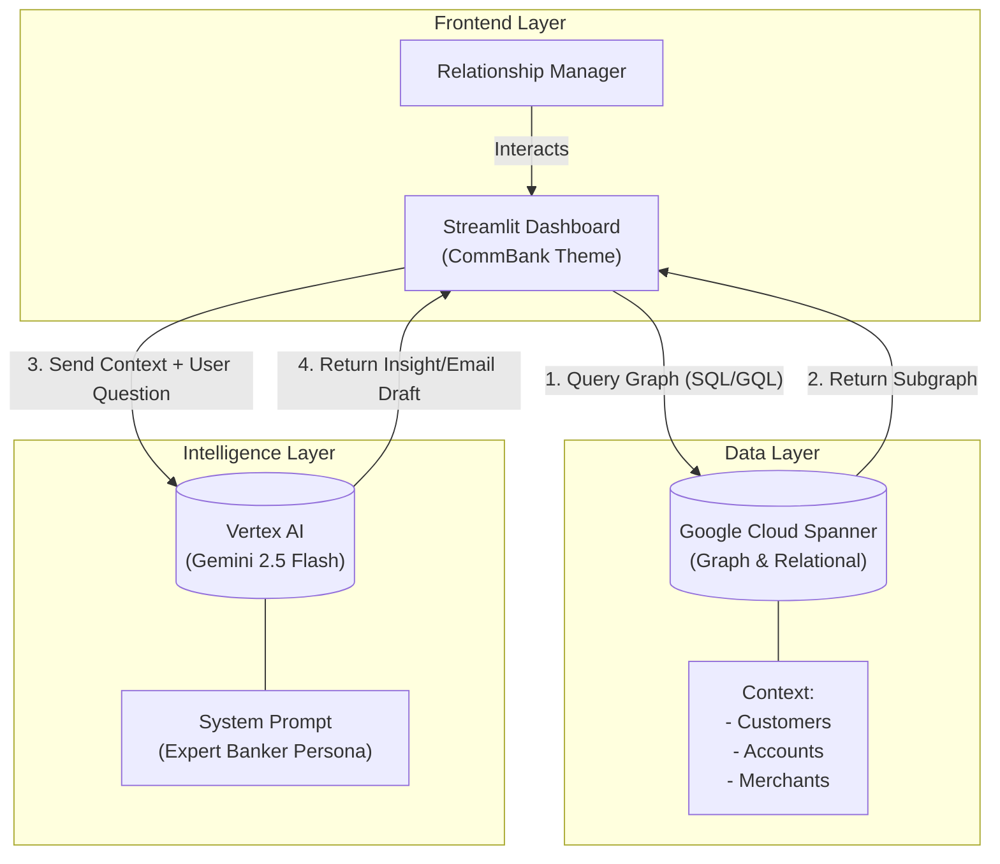

# 🏦 CommBank Customer Twin Demo Script

## 🎯 Demo Goal
Showcase how **Spanner Graph** and **Vertex AI** enable hyper-personalised banking experiences by combining transactional data with semantic context.

## 👤 Persona
**You are a Senior Relationship Manager at CommBank.**  
You are preparing for a meeting with a high-value client (or reviewing a segment for a new product launch). You use this tool to get an instant, holistic view of the customer's life and financial behavior.

## 🏗️ Technical Architecture

### 🧠 How It Works (The Data Flow)
1.  **Query Graph:** When you select a customer, the app queries **Spanner** to get their "Ego Graph" (the customer + all connected accounts & merchants).
2.  **Context Construction:** The app converts this structured graph data into a text-based format (e.g., *"Customer X paid $50 to Merchant Y"*).
3.  **Prompting:** This text context is combined with your specific question (e.g., *"Draft an email..."*) and a System Prompt that defines the "Expert Banker" persona.
4.  **Inference:** **Vertex AI (Gemini)** analyses the combined prompt and generates a response, referencing the specific data points provided.

---

## 🎬 Act 1: The 360° Graph View
**Talk Track:**
> "Traditionally, customer data is siloed—savings in one system, credit cards in another. Here, Spanner Graph unifies everything.
> I select a customer, say **[Customer Name]**, and instantly see their **Financial Knowledge Graph**."

**Action:**
1.  Select **"Young Professional"** (or similar) from the `Select Segment` dropdown.
2.  Select a specific customer from `Select Customer`.
3.  Point out the **Yellow Nodes** (Customer) connected to **Grey/White Nodes** (Accounts) and **Green Nodes** (Merchants).
4.  Hover over a Merchant node to show details (e.g., "Starbucks", "Uber").

---

## 💬 Act 2: Chat with Knowledge Plane (The "Wow" Moment)
**Talk Track:**
> "Now, instead of writing SQL queries to understand this customer, I can just ask our **Knowledge Plane AI** (powered by Gemini)."

**Action:**
Switch to the **"💬 Chat with Twin"** tab.

**Scenario A: Lifestyle Analysis**
*   **Question:** "What is this customer's spending persona?"
*   **Expected Insight:** AI identifies patterns (e.g., "Foodie" or "Traveler") based on merchant categories.

**Scenario B: Financial Health Check**
*   **Question:** "Can they afford a $500 emergency bill today?"
*   **Expected Insight:** AI checks account balances/liquidity.

**Scenario C: Churn Risk / Competitor Intel**
*   **Question:** "Are they interacting with any competitors?"
*   **Expected Insight:** AI scans for other banks or lenders.

**Scenario D: Life Event Detection**
*   **Question:** "Do you see any signs of major life events?"
*   **Expected Insight:** AI detects clusters like travel or moving.

**Scenario E: Actionable Outreach (Draft Email)**
*   **Question:** "Draft an email offering our Platinum Travel Card based on this data."
*   **Expected Insight:** AI automatically personalises the draft using the travel context it found.

---

## 🚀 Act 3: Product Simulation
**Talk Track:**
> "Finally, I want to see if our new 'Platinum Travel Card' is a good fit for this segment. Instead of a/b testing on live customers, I can simulate it on their Twins."

**Action:**
1.  Switch to **"🤖 Twin Simulation"**.
2.  Enter **Product Name**: "CommBank Travel Rewards".
3.  Enter **Terms**: "Zero international fees, 3x points on flights."
4.  Click **Run Simulation**.
5.  Show the predicted **Adoption %** and **Sentiment**.

> "The AI predicts a **[High/Low]** adoption rate because this segment has high spending on [Travel/Airlines], matching the card's benefits."

---

## 📝 Key Takeaways for Audience
1.  **Graph = Context:** We see relationships (Customer -> Account -> Merchant), not just rows.
2.  **GenAI = Interface:** Natural language questions replace complex queries.
3.  **Simulation = Safety:** Test products on "Twins" before launching.
